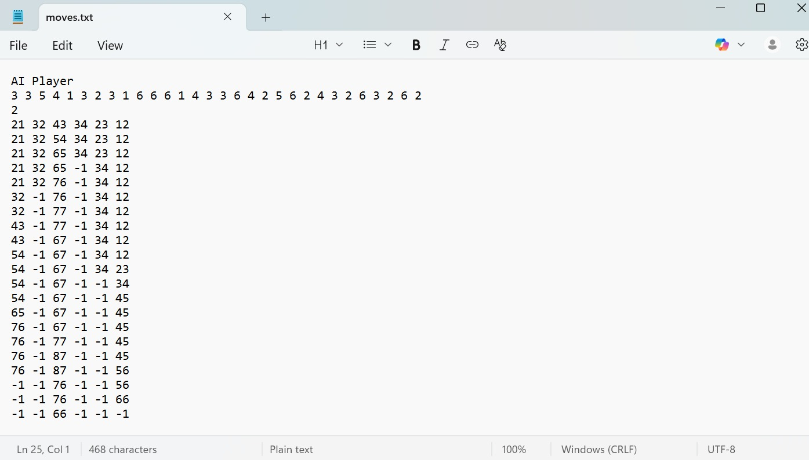
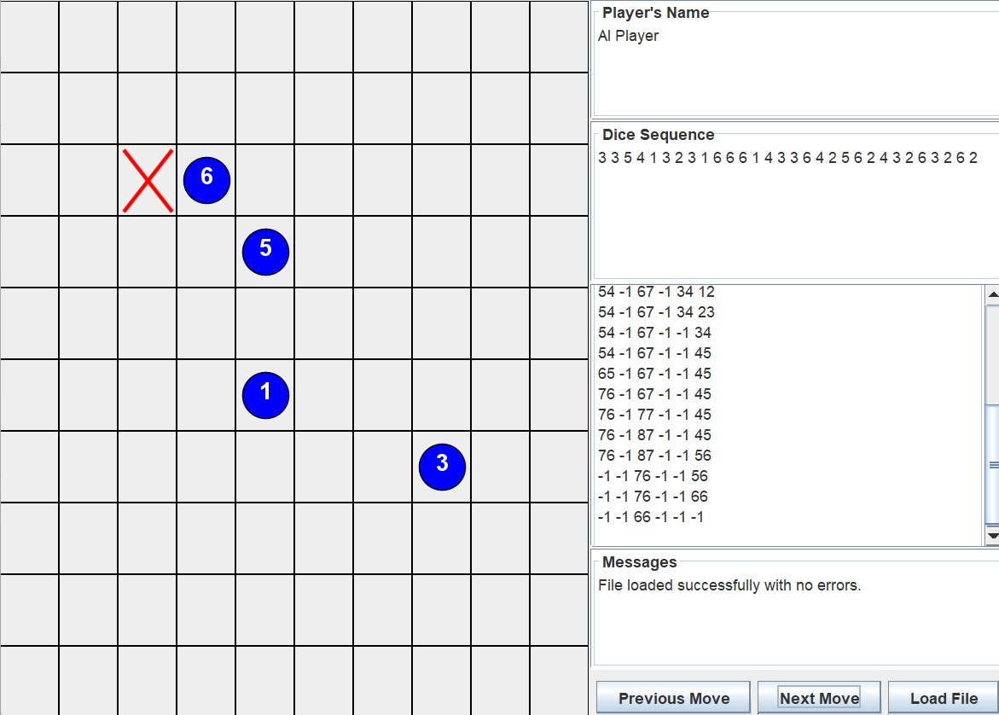

EWN-Puzzle/
│
├── pom.xml                     <-- Maven build configuration file
│
├── src/
│   ├── main/
│   │   ├── java/               <-- Your main Java source files
│   │   │   └── ewnpuzzle/
│   │   │       ├── GameMain.java
│   │   │       ├── GameLoader.java
│   │   │       ├── GameState.java
│   │   │       ├── Player.java
│   │   │       ├── HumanPlayer.java
│   │   │       ├── RandomPlayer.java
│   │   │       ├── AIPlayer.java
│   │   │       └── Move.java
│   │   │
│   │   └── resources/          <-- Non-code resources (input/output files)
│   │       ├── levels/
│   │       │   ├── level1.txt
│   │       │   ├── level2.txt
│   │       │   ├── level3.txt
│   │       │   └── level4.txt
│   │       └── output/
│   │           └── moves.txt
│   │
│   └── test/
│       └── java/               <-- Unit tests (optional)
│           └── ewnpuzzle/
│               └── GameStateTest.java
│
└── target/                     <-- (Auto-generated when you build)
    ├── classes/
    └── EWN-Puzzle-1.0-SNAPSHOT.jar

 --------
 <-- Example of what is inside moves.txt
\# First row after the AI Player shows the die roll for that turn.
\# Second row tells use the target piece, the one that should get to column 0 row 0 to win.
\# Third row onwards is the current position of the pieces respectively 1 to 6, and -1 means the piece is taken.

 <-- Example of the game's GUI
\# this image shows us the GUI of the game.
\# Error messages will show up on Messages, e.g, Illegal move at turn ..., Already at first/last step.
\# Steps tab shows the loaded steps from chosen file (moves.txt).
\# Dice Sequence Shows the die roll respectively from 1 - x.
\# X on Box 22 (row 3, col 3) means that box is removed or cannot be used.
\# Previous / Next move buttons to load Previous / Next move.
 --------